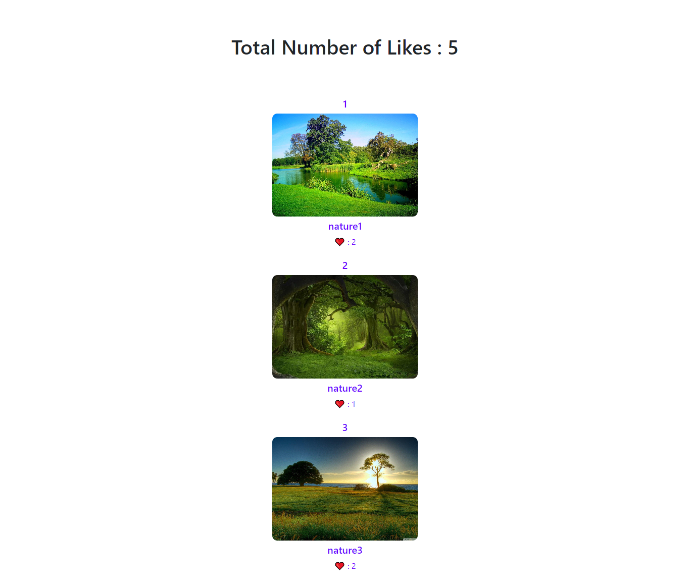

** **Application:**
create a react application (using functions components) that displays images and number of likes for each image. This application will allow you to like any image and to see the total number of likes for all images.

* **Author:**
Noor Alkhateeb

* In the project directory, you can run:

`npm start`

